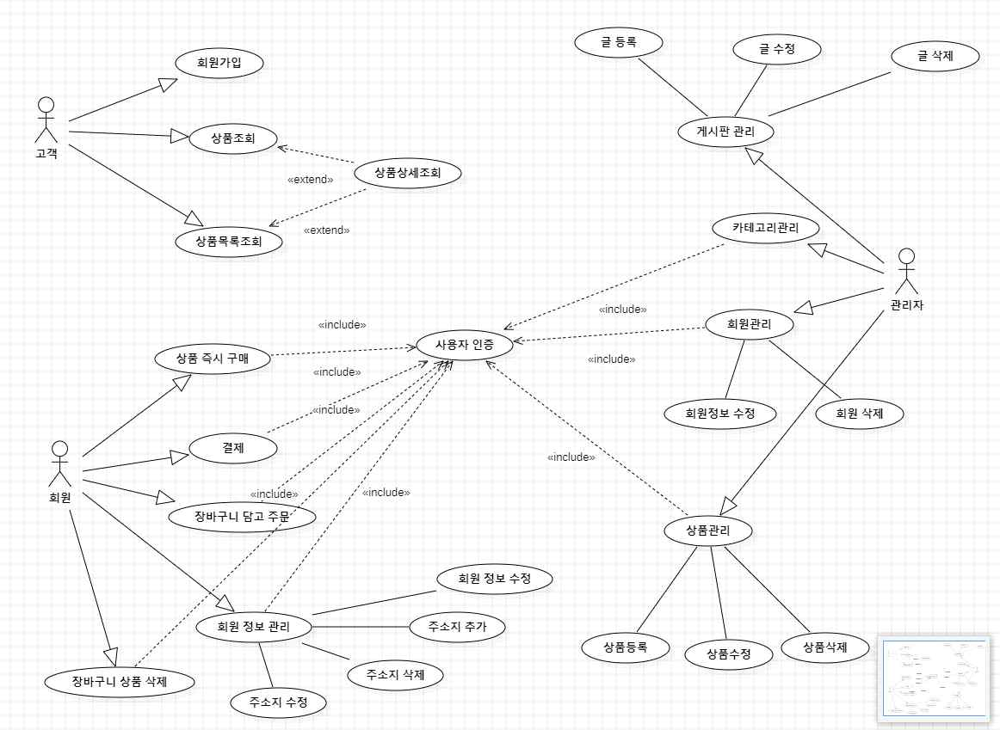
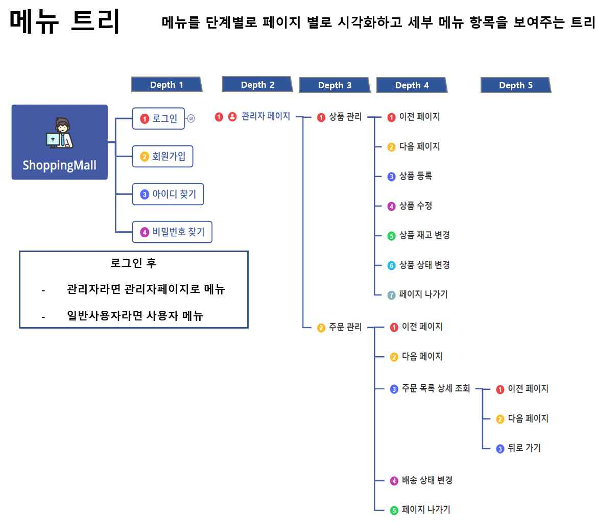
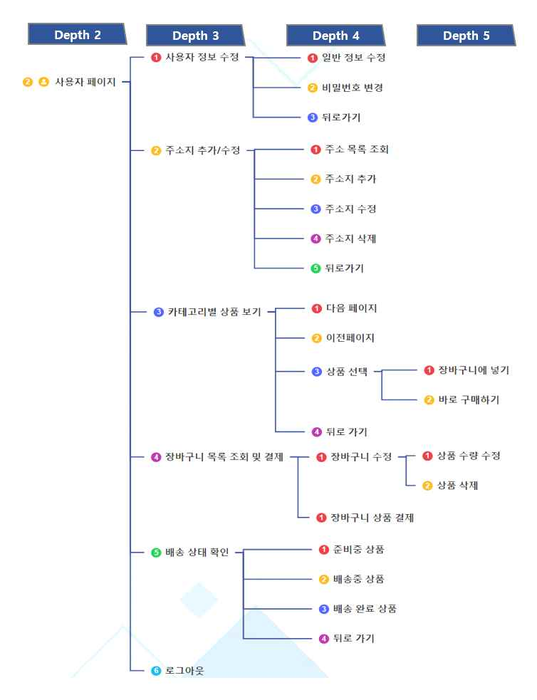
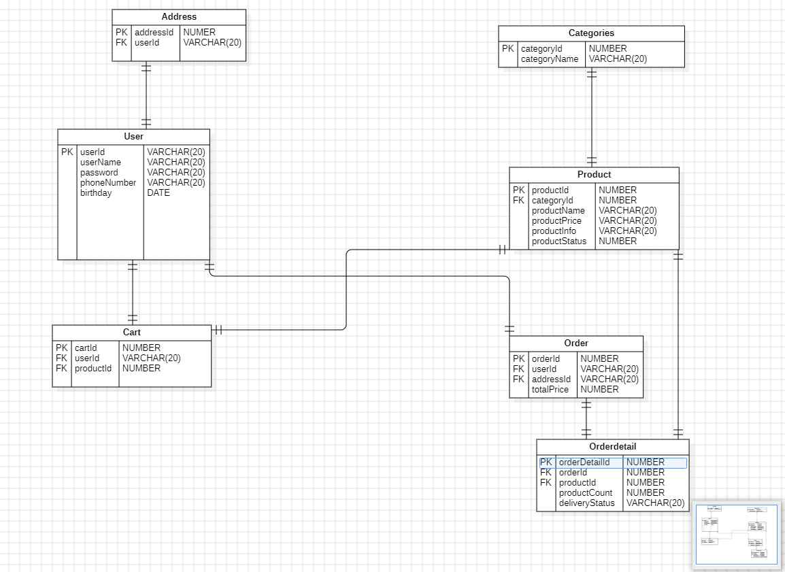
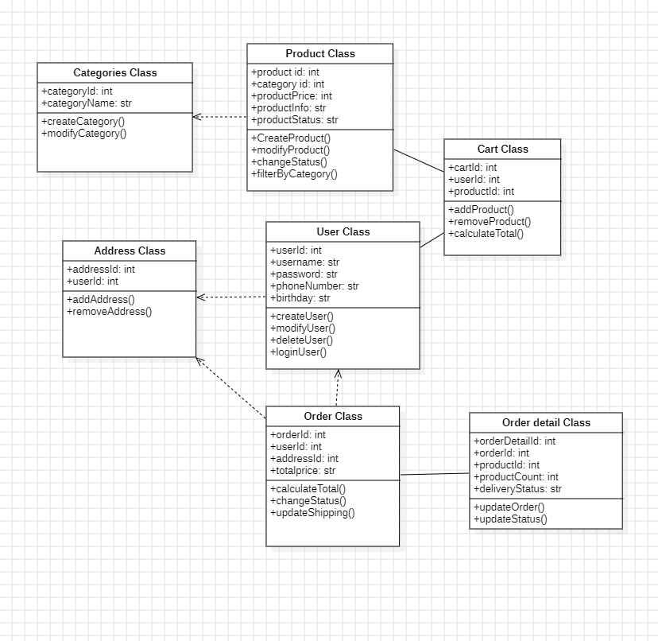

# shoppingmall-system-design

> 온라인 쇼핑몰 백엔드 시스템 설계 — 유스케이스 분석 · 요구사항 정의 · DB 모델링

실제 구현보다 **설계 역량**에 집중한 프로젝트로, 유스케이스 다이어그램에서 요구사항 정의서, DB 설계까지 단계적으로 진행했습니다.

---

## 사용 기술

- UML (유스케이스 다이어그램, 클래스 다이어그램)
- ERD 설계
- 요구사항 정의서 작성

---

## 주요 기능 설계 범위

| 액터 | 기능 |
|------|------|
| 고객 | 상품 조회, 회원가입 |
| 회원 | 구매, 장바구니, 주문 내역, 정보 수정 |
| 관리자 | 상품 등록·수정·삭제, 주문 관리, 배송 상태 변경 |

---

## 산출물

### 유스케이스 다이어그램

### 메뉴 트리

### ERD

### 클래스 다이어그램

---

## 수행 내용

- 요구사항 정의서 작성 (기능별 상세 명세)
- 액터 추출 및 유스케이스 다이어그램 작성
- ERD 설계 (회원 / 상품 / 주문 / 장바구니 / 카테고리)
- 클래스 다이어그램 작성
- 메뉴 흐름도 작성

---

## 맡은 역할

- 액터 및 유스케이스 추출
- 클래스 다이어그램 작성
- 메뉴 흐름도 작성
- PPT 발표 자료 제작

---

## 배운 점

단순히 "기능을 나열"하는 것과 "요구사항을 구조화"하는 것은 전혀 다르다는 점을 배웠습니다. 처음에는 기능 목록을 텍스트로 적는 수준이었는데, 액터별로 유스케이스를 분류하고 관계를 정의하는 과정에서 시스템 전체 흐름이 눈에 들어오기 시작했습니다.

ERD 설계에서 주문과 주문상세를 분리하는 이유, 장바구니와 주문이 별개 테이블로 존재해야 하는 이유 등 **정규화의 필요성**을 구체적인 케이스로 이해하게 되었습니다.

---

## 어려웠던 점

요구사항 정의 초기에 어디까지 기능을 넣어야 할지 경계를 정하는 게 어려웠습니다. 팀원마다 생각하는 서비스 범위가 달랐고, 합의하는 과정에서 시간이 많이 소요됐습니다. 실제 개발 프로젝트에서도 요구사항 범위 설정이 가장 중요한 초기 작업임을 체감했습니다.

또한 배송 상태 변경 기능을 설계할 때, 상태 전이 흐름을 명확히 정의하지 않아 관리자 기능과 사용자 기능이 겹치는 부분이 발생했습니다. 상태 다이어그램을 먼저 그렸더라면 더 명확한 설계가 가능했을 것 같습니다.

---

## 현재 문제점

- **구현 없는 설계**: 요구사항과 ERD는 있지만 실제 코드가 없어, 설계의 타당성을 실제로 검증하지 못했습니다. 설계대로 구현할 때 어떤 문제가 생기는지 알 수 없습니다.
- **동시성 고려 누락**: 같은 상품을 여러 사용자가 동시에 구매할 때 재고 처리를 어떻게 할 것인지 설계에서 다루지 않았습니다. 현실에서는 가장 중요한 기술적 문제 중 하나입니다.
- **배송 상태 전이 미정의**: `PREPARING → SHIPPING → DELIVERED` 흐름은 있지만, 취소·반품·교환 상태는 정의되지 않았습니다. 실제 쇼핑몰에서 필수적인 케이스입니다.
- **페이징 방식의 성능 문제**: OFFSET 기반 페이징을 가정했는데, 데이터가 수십만 건 이상이 되면 OFFSET이 클수록 쿼리가 느려지는 문제가 있습니다.

## 고민해야 할 점

- **재고 동시성 처리**: 두 사용자가 재고 1개짜리 상품을 동시에 구매 요청했을 때 어떻게 처리할까요? 비관적 락(Pessimistic Lock)과 낙관적 락(Optimistic Lock) 중 어느 방식이 적합한지, 트랜잭션 격리 수준을 어떻게 설정해야 하는지 고민이 필요합니다.
- **장바구니 구조**: 장바구니에 담을 때 재고를 차감해야 할까요? 아니면 실제 결제 시에만 차감해야 할까요? 전자는 재고 선점 문제, 후자는 장바구니 이후 재고 소진 문제가 생깁니다. 실제 서비스는 어떻게 처리하는지 조사하고 싶습니다.
- **커서 기반 vs OFFSET 페이징**: 무한 스크롤이 필요한 경우 커서 기반 페이징이 OFFSET보다 성능상 유리합니다. 하지만 구현이 복잡해지는데, 어느 시점에 전환을 고려해야 하는지 기준을 세우고 싶습니다.

## 아쉬운 점 및 개선 방향

- 설계로만 끝났고 실제 코드로 구현하지 못한 점이 가장 아쉽습니다. 설계한 ERD를 바탕으로 Spring Boot + JPA로 백엔드를 직접 구현해보고 싶습니다.
- 재고 동시 주문 처리, 트랜잭션 등 설계 단계에서 고려하지 못한 동시성 이슈가 실제 구현 시 중요한 과제가 될 것 같습니다.
- 페이징 방식으로 OFFSET 기반을 가정했는데, 데이터가 많아질 경우 성능 저하가 발생할 수 있어 커서 기반 페이징으로 개선이 필요합니다.

---

## 추가로 공부해야 할 내용

- Spring Boot + JPA를 활용한 실제 구현
- 데이터베이스 트랜잭션 (ACID, 격리 수준)
- 동시성 처리 (비관적 락 / 낙관적 락)
- 커서 기반 페이징
- REST API 설계 원칙
